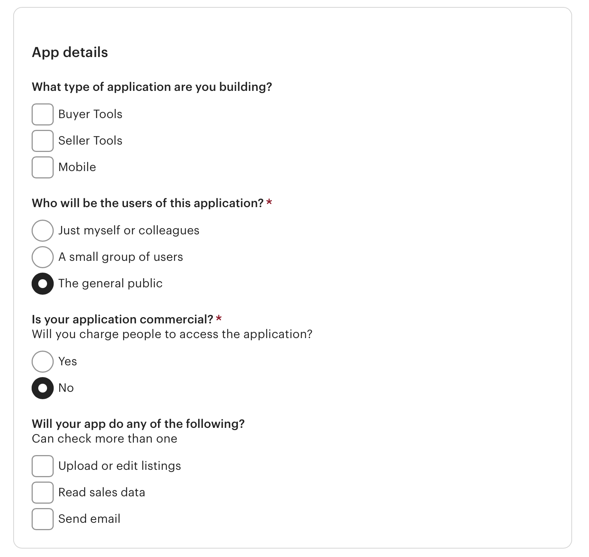

# velvet-ash-vintage

## Description

This app is a website for the small business Velvet Ash Vintage, a reseller who specializes in vintage items and clothes. Curating a vibe is extremely important to Velvet Ash when it comes to the items she sells, so bringing that vibe to this site was a must. The client also wanted to link to and integrate all of her other selling platforms and apps in some way, and the more responsive the integration, the better. 

These days, successfully selling online often requires a presence on a variety of apps and websites, so a big goal was to give customers a place to see a sample of everything she has to offer all in one place, but in a much more visual, interactive, and customized way than something like a Linktree page is able to.

This was a great experience working with a client and testing my skills to achieve the look and functionality they requested. It gave me a lot of good practice figuring out what information I needed from the client, conveying feedback on ideas or possible limitations, and giving status updates on the project.

Along the way, I was able to try out a lot of new concepts with CSS, especially integrating the React-specific version of Bootstrap, in addition to standard Bootstrap items not covered by React-Bootstrap, and my own customized CSS styling as well. It was a fun challenge to try to recreate the look and functionality of a few inspiration pages that the client had provided. I was also able to get much more in-depth with customizing how the content displayed across all screen sizes than I had ever been able to accomplish previously.

## Table of Contents

- [Installation](#installation)
- [Usage](#usage)
- [Credits](#credits)
- [License](#license)

## Installation

Rename the `.env.EXAMPLE` file to `.env`.

You'll need to specify a url for your application in a few of the following steps, so I would recommend deploying the site early for that reason alone, even though you'll still need to complete those steps in order for it to deploy correctly (without modification). I deployed my site to [Render](https://render.com/).

You'll need an Etsy account to [register your app with Etsy](https://www.etsy.com/developers/register) so that you can get a `KEYSTRING` and `SHARED_SECRET` to enter into your `.env` file. You do not need to request or receive OAUTH access for the purposes of this app. In my experience, it took Etsy a fairly long time (around a month) to approve my app and make my API keys active, so don't necessarily assume they have denied your request if the [request status](https://www.etsy.com/developers/your-apps) is not updated quickly. I used the following options when submitting my request (fields without selections were left blank intentionally):

You'll then also need to [register your app with Tumblr](https://www.tumblr.com/oauth/apps) to get your `TUMBLR_CONSUMER_KEY` and `TUMBLR_CONSUMER_SECRET` and add those to the `.env` file as well. Unlike Etsy, Tumblr didn't require a long approval process and I was able start using these almost immediately.

For local use:
- Run the following commands `npm install` `npm run build` `npm run develop` to run the program and start the server. 
- You will not need to specify anything for the `NODE_ENV` variable in the `.env` file, but you will need to have values for all the rest.

In production (deployed):
- Use `npm run render-build` for the build command, and `npm run start` for the start command. 
- You will need to specify `production` for the `NODE_ENV` variable, along with all the other parameters you'd used in the local `.env` file.

## Usage

Using the app is designed to be as straightforward and user friendly as possible. Links to all pages are in the navbar, and for small screens and mobile devices, a button with 3 horizontal lines will be shown, which if clicked will expand the navbar and display the pages. At the bottom of the page, links to the client's other shops and profiles are linked on icons for each associated platform.

The user will initially see the `Home` page, which shows featured items pulled from the client's Etsy shop, below which is a photo spread containing sample product photos provided by the client.

The `About` page contains a profile photo and a short description with some background on the client. This page will intelligently scale both the photo and text, switching the amount of columns and aspect ratio for smaller screens or mobile devices for improved readability.

The `Gallery` page contains a grid of images pulled from the client's Tumblr, which helps reinforce the shop's aesthetic brand to page visitors and potential buyers.

The `Shop` page showcases more items pulled from the client's Etsy. The items are pulled from Etsy on every page load to ensure the most up-to-date listings are being shown at all times (the same applies for the featured items on the Home page).

## Credits

Thank you to Velvet Ash Vintage for being an all-around wonderful client. Your reference pages, feedback on my progress reports, and general asthetic decisiveness (aka knowing exactly what you like and what you want) all made my job much that much easier. It's been a pleasure to make this site a reality for you!

Here are links to [Etsy's](https://developers.etsy.com/documentation/) and [Tumblr's](https://www.tumblr.com/docs/en/api/v2) API documentation.

Thanks to [CorsProxy](https://corsproxy.io), which provided a simple solution to CORS errors I was initially receiving when trying to display Etsy images using the links provided in their API's responses.

## License

n/a